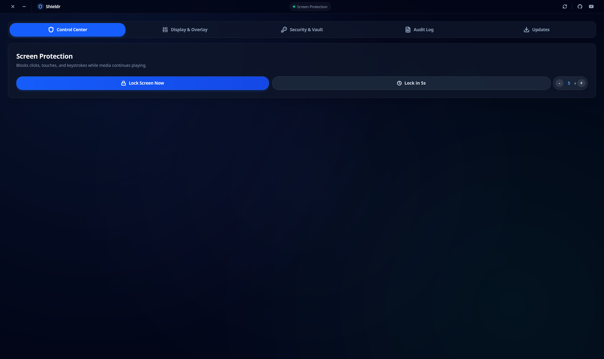
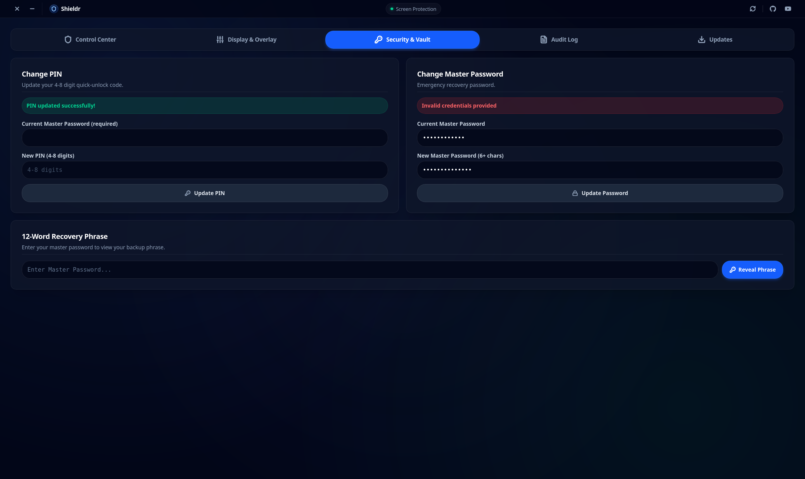

# 🛡️ Shieldr

> **Defending your computer against the world's most chaotic penetration testers: toddlers and cats.**  
> *Zero-compromise transparent screen lock and touch barrier for Linux, macOS & Windows.*

[](https://peerlist.io/ahmedtrooper/project/shieldr)
[](https://github.com/AhmedTrooper/Shieldr/releases)
[](https://tauri.app)
[](https://www.rust-lang.org)
[](https://www.solidjs.com)
[](LICENSE)

---

## 📸 Preview

| Control Dashboard | Security & Dual-Vault |
| :---: | :---: |
|  |  |

---

## 💡 What is Shieldr?

Have you ever handed your laptop or computer to a toddler to watch a cartoon, only to have them accidentally close the video, spam keys, delete important files, or trigger system shortcuts? 

**Shieldr** creates a transparent, fullscreen, always-on-top interactive barrier that intercepts mouse clicks, touch gestures, drags, and OS shortcut keys while letting background videos, presentations, or applications continue playing completely unobstructed.

Unlike basic screen blockers that blank out your monitor, Shieldr keeps your media 100% visible while making your screen touch-proof and toddler-proof.

---

## ✨ Features

- 🛡️ **Transparent Click & Gesture Interceptor**: Completely traps mouse clicks, scrolling, drag-and-drop, and touch input without obscuring the background.
- 🔒 **OS-Level Anti-Escape Guardrails**: Intercepts escape keystrokes and system shortcuts (`Alt+F4`, `Super/Win`, `Ctrl+W`, `Alt+Tab`). Window attempts to un-fullscreen, move, or minimize are automatically snapped back into place.
- 🔐 **Zero-Knowledge Dual Vault**:
  - **Quick Unlock PIN (4–8 digits)**: Fast numeric entry for day-to-day locking and unlocking.
  - **Master Password**: Argon2id-hashed credentials required for privileged actions like changing PIN or rotating keys.
  - **12-Word BIP-39 Recovery Phrase**: Cryptographic mnemonic phrase for disaster recovery.
  - Secrets are encrypted with **Tauri Stronghold** and synchronized with your **OS Keyring** (no plain text in memory or SQLite).
- ⏱️ **Brute-Force Rate Limiting**: Exponential lockout penalties protect against automated keypad brute-forcing.
- 🎨 **Frosted Glass & Display Customization**: Adjust opacity and blur from 100% invisible transparent overlay to frosted glass or full blackout.
- 📍 **Discrete Floating Lock Badge**: Minimalist padlock widget with configurable position (Floating, Center, Top-Right, Bottom-Right) and automatic idle fade-out.
- 🔊 **Procedural Web Audio FX**: Synthesized mechanical clicks, keypad beeps, and unlock chimes with zero external audio assets.
- 📜 **Tamper-Resistant Audit Trail**: Built-in SQLite-backed paginated audit log tracking lock, unlock, and credential events.

---

## 📥 Installation

Download the latest version ready to run on your operating system directly from our Releases page:

👉 **[Download Latest Release from GitHub Releases](https://github.com/AhmedTrooper/Shieldr/releases)**

| Operating System | Package Format |
| :--- | :--- |
| **Linux** | `.deb` (Debian/Ubuntu), `.AppImage` (Universal Linux) |
| **macOS** | `.dmg` (Universal Apple Silicon & Intel) |
| **Windows** | `.msi` (Installer), `.exe` (Portable) |

---

## 🛠️ Development & Building from Source

### Prerequisites
- [Bun](https://bun.sh) (v1.0+)
- [Rust](https://rustup.rs) (v1.75+)
- Platform-specific Tauri v2 build tools ([Tauri Prerequisites Guide](https://v2.tauri.app/start/prerequisites/))

### Getting Started

```bash
# 1. Clone the repository
git clone https://github.com/AhmedTrooper/Shieldr.git
cd Shieldr

# 2. Install frontend dependencies
bun install

# 3. Launch application in development mode
bun run tauri dev
```

### Running Tests & Linting

```bash
# Run TypeScript checks & Vite build
bun run lint
bun run build

# Run Rust formatting, clippy, and unit test suite
cd src-tauri
cargo fmt --check
cargo clippy -- -D warnings
cargo test
```

### Production Build

```bash
bun run tauri build
```

The compiled binaries will be output into `src-tauri/target/release/bundle/`.

---

## 🤝 Community & Feedback

- 🌟 Star the project on GitHub: [AhmedTrooper/Shieldr](https://github.com/AhmedTrooper/Shieldr)
- 🚀 Upvote & discuss on Peerlist: [Shieldr on Peerlist](https://peerlist.io/ahmedtrooper/project/shieldr)
- 🐛 Found a bug or have a suggestion? Open an issue on [GitHub Issues](https://github.com/AhmedTrooper/Shieldr/issues)

---

## 📄 License

Shieldr is open source under the [MIT License](LICENSE).
